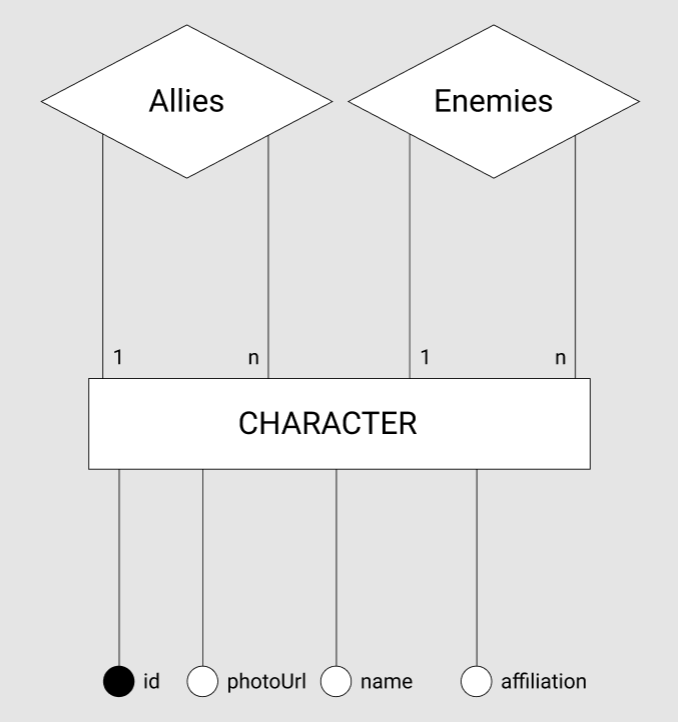

## `lab01`

## Tarefa 1 sobre APIs de acesso

> Coloque um link para o arquivo do notebook com a resolução da primeira tarefa (dois acessos). Ele estará dentro da pasta `notebook`.

## Tarefa 2 sobre Engenharia Reversa
> 
