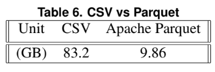

# Artigo de Dataset Público

# Aluno
* `239104`: `Leonardo Almeida Reis`

# Análise do Artigo `Extracting and Composing a Dataset of Competitive Counter-Strike Global Offensive Matches`

| campo | valor |
|------------|----------------------------------------|
| referência | `Referências ao final do PDF do link` |
| link       | `https://drive.google.com/file/d/106Ps__OM8ryapvP958FAIyhEWkzf_XfS/view` |
| dataset | `https://labnet.nce.ufrj.br/files/CSGO_Dataset/` |
| formato | `Apache Parquet` |

## Resumo

> O artigo busca coletar e disponibilizar informações de várias partidas extraídas de campeonatos profissionais do jogo Counter-Strike Global Offensive. Tais dados expoem tanto informações "high-level" (como data da partida, placar, jogadores e time) quanto informações "low-level" (como posição dos jogadores a cada frame, momento dos tiros disparado por cada arma e morte de cada jogador). Esses dados visam possibilitar futuras análises mais profundas do jogo a partir do relacionamento entro os dados mais abrangentes com os dados mais detalhados.
>  
>  O banco de dados foi construído no formato Apache Parquet em vez de CSV afim de utilizar menos espaçode disco, como é possível observar na Figura 1. Além disso, afim de otimizar a análise dos dados, o banco foi construído em formato de colunas, possibilitando a leitura apenas das informações necessárias de cada tabela.

*Figura 1: Volume dos Dados em CSV vs Apache Parquet*

## Perguntas de pesquisa/análises

> Como a movimentação dos jogadores pelo mapa influenciana vitória? 
> 
> Quais são as estratégias mais adotadas e as que mais tem sucesso?
> 
> Como identificar cheaters (trapaceiros) a partir do comportamento do jogador?

## Trabalhos relacionados

> [Varvello and Voelker 2010, Varvello et al. 2008] - Uma das primeiras iniciativas de extração de dados de jogos, feita no Second Life.
> 
> [Xenopoulos et al. 2020] - Projeto open source extração de dados feita no Couter-Strike, porém os dados não são publicamente acessíveis.
> 
> [Bednarek et al. 2017] - Extração e análise de dados do jogo Counter-Strike que busca prever a performance de um jogador.
