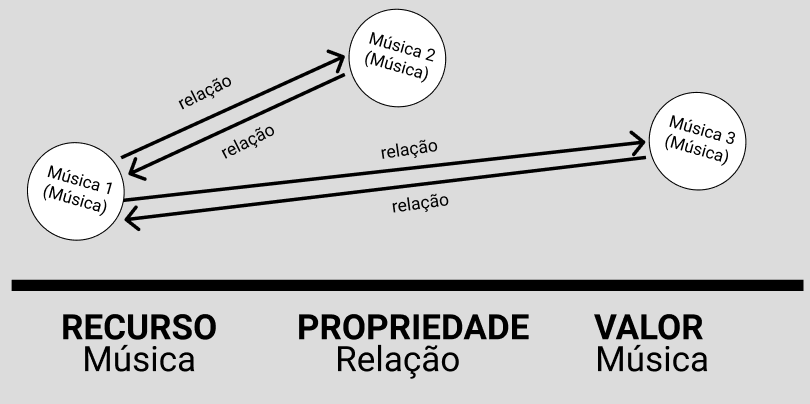

# Grafo de Conhecimento - `lab09`

# Aluno
* `239104`: `Leonardo Almeida Reis`

## Exemplo de Grafo de Conhecimento - para publicar ou enriquecer
>
> Modelo:
> 
>
> Exemplo real:
> 

## Perguntas de Pesquisa ou Queries

> Liste aqui as três perguntas de pesquisa ou queries
> * Qual a chance da pessoa que gosta de música X também gostar da música Y?
> * Quais parâmetros influenciam mais para um peso maior nas relações?
> * Que grupo de músicas uma pessoa tem mais chance de gostar?
